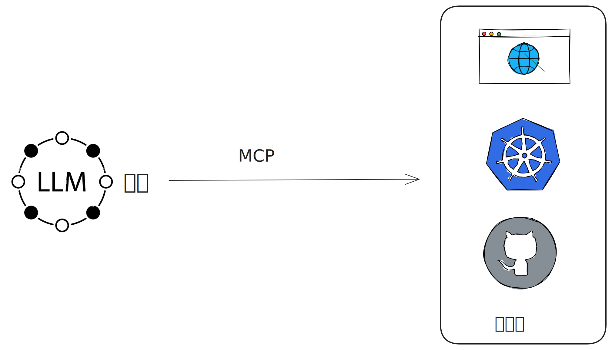
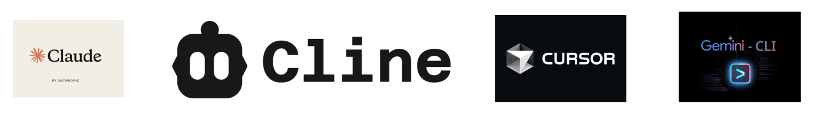
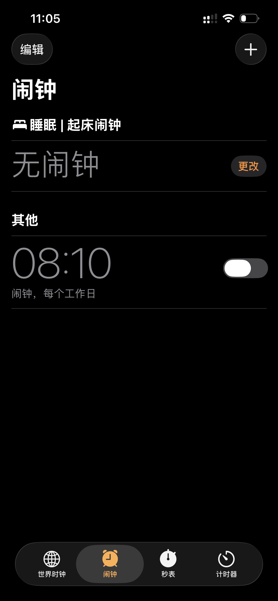

## 简要介绍

[model-context-protocol](https://www.anthropic.com/news/model-context-protocol)

[mcp-intro](https://modelcontextprotocol.io/docs/getting-started/intro)

---

Model Context Protocol

模型   上下文   协议

---

### 用途



---

### MCP Host

- 支持MCP协议的软件 比如：
  - Claude Code
  - Cursor
  - Cline
  - Gemini Cli
  - ...



---

### MCP Server 和 Tool

- `MCP Server`(MCP服务器)
  - 不是传统意义上的服务器
  - 本质就是一个程序，程序执行符合`MCP`协议，内置了一些功能模块解决对应问题
    - 功能模块 在MCP领域内叫：Tool(函数)
  - 大部分`MCP Server`都是在本地通过Python或Node启动

---



---

[weather-mcp-server](https://github.com/ezh0v/weather-mcp-server)

```go
package tools

import (
    "github.com/mark3labs/mcp-go/mcp"
    "github.com/mark3labs/mcp-go/server"

    "github.com/ezh0v/weather-mcp-server/internal/server/handlers"
    "github.com/ezh0v/weather-mcp-server/internal/server/services"
)

func CurrentWeather(svc services.Services) (mcp.Tool, server.ToolHandlerFunc) {
    tool := mcp.NewTool("current_weather",
        mcp.WithDescription(`
            The service retrieves the current weather for a specified city and returns only HTML and CSS code designed 
            for displaying weather information directly on a canvas. No additional comments should be included after the response. 
            It processes the city's name, gathers weather data such as temperature, humidity, wind speed, and general weather conditions, 
            and then generates a structured HTML layout along with appropriate CSS styles. This HTML must be rendered visually on the canvas. 
            After receiving the response, the text inside the HTML should be translated into the language of the request.
        `),
        mcp.WithString("city",
            mcp.Required(),
            mcp.Description(`
                The name of the city. This field is required and must be provided in English. 
                Only one city is allowed, and it must be the last one provided by the user.
            `),
        ),
    )

    handler := handlers.CurrentWeather(svc)

    return tool, handler
}
```

---

### MCP交互流程详解
