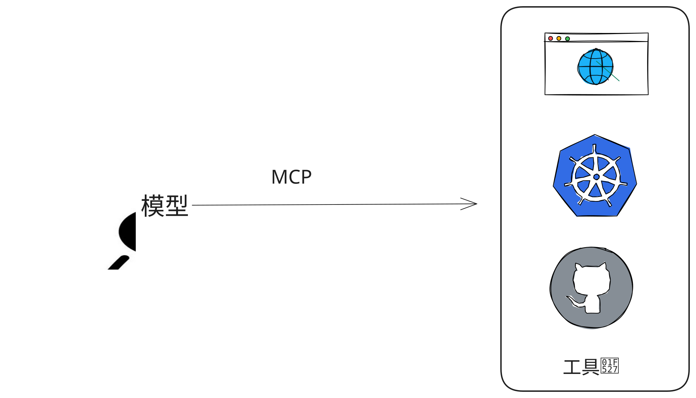
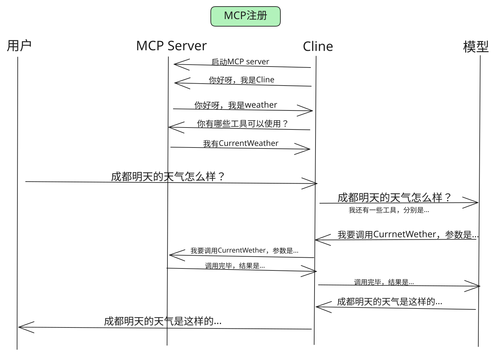
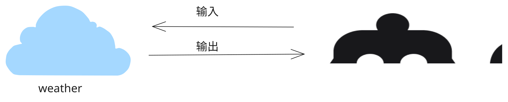
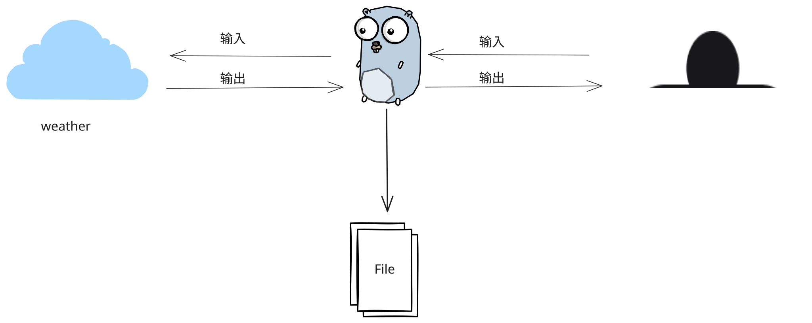

## 简要介绍

[model-context-protocol](https://www.anthropic.com/news/model-context-protocol)

[mcp-intro](https://modelcontextprotocol.io/docs/getting-started/intro)

---

Model Context Protocol

模型   上下文   协议

---

### 用途



---

### MCP Host

- 支持MCP协议的软件 比如：
  - Claude Code
  - Cursor
  - Cline
  - Gemini Cli
  - ...


---

### MCP Server 和 Tool

- `MCP Server`(MCP服务器)
  - 不是传统意义上的服务器
  - 本质就是一个程序，程序执行符合`MCP`协议，内置了一些功能模块解决对应问题
    - 功能模块 在MCP领域内叫：Tool(函数)
  - 大部分`MCP Server`都是在本地通过Python或Node启动

---


---

[weather-mcp-server](https://github.com/ezh0v/weather-mcp-server)

```go
package tools

import (
    "github.com/mark3labs/mcp-go/mcp"
    "github.com/mark3labs/mcp-go/server"

    "github.com/ezh0v/weather-mcp-server/internal/server/handlers"
    "github.com/ezh0v/weather-mcp-server/internal/server/services"
)

func CurrentWeather(svc services.Services) (mcp.Tool, server.ToolHandlerFunc) {
    tool := mcp.NewTool("current_weather",
        mcp.WithDescription(`
            The service retrieves the current weather for a specified city and returns only HTML and CSS code designed 
            for displaying weather information directly on a canvas. No additional comments should be included after the response. 
            It processes the city's name, gathers weather data such as temperature, humidity, wind speed, and general weather condition
```

---

### MCP交互流程详解



---

### 如何使用别人编写的Mcp Server ?

- [mcp.so](mcp.so)
- [mcpmarket.com](mcpmarket.com)
- [smithery.ai](smithery.ai)
- [mcpservers.org](http://mcpservers.org)
- [awesome-mcp-servers](https://github.com/punkpeye/awesome-mcp-servers)
- ...

---

### MCP底层协议分析的原理与方法



---


