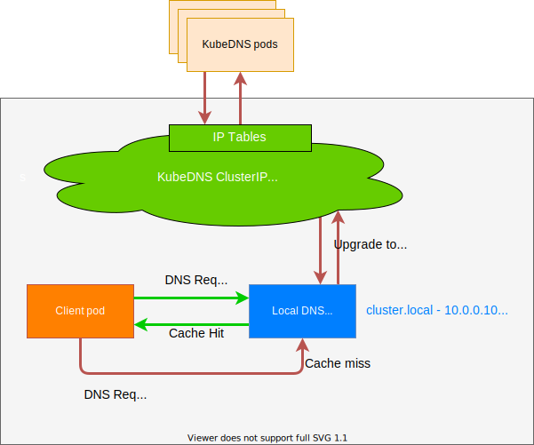

## DNS优化

- Kubernetes集群中 我们可以使用CoreDNS来进行集群的域名解析 但是如果在集群规模较大并发较高的情况下 我们仍然需要对DNS进行优化
- 典型问题：CoreDNS会出现超时5s的情况

### 超时原因

- 在iptables模式下(默认情况) 每个服务的kube-proxy在主机网络名称空间的NAT表中创建iptables规则
- 比如在集群中具有两个DNS服务器实例的kube-dns服务 相关规则大致如下

```bash
(1) -A PREROUTING -m comment --comment "kubernetes service portals" -j KUBE-SERVICES
<...>
(2) -A KUBE-SERVICES -d 10.96.0.10/32 -p udp -m comment --comment "kube-system/kube-dns:dns cluster IP" -m udp --dport 53 -j KUBE-SVC-TCOU7JCQXEZGVUNU
<...>
(3) -A KUBE-SVC-TCOU7JCQXEZGVUNU -m comment --comment "kube-system/kube-dns:dns" -m statistic --mode random --probability 0.50000000000 -j KUBE-SEP-LLLB6FGXBLX6PZF7
(4) -A KUBE-SVC-TCOU7JCQXEZGVUNU -m comment --comment "kube-system/kube-dns:dns" -j KUBE-SEP-LRVEW52VMYCOUSMZ
<...>
(5) -A KUBE-SEP-LLLB6FGXBLX6PZF7 -p udp -m comment --comment "kube-system/kube-dns:dns" -m udp -j DNAT --to-destination 10.32.0.6:53
<...>
(6) -A KUBE-SEP-LRVEW52VMYCOUSMZ -p udp -m comment --comment "kube-system/kube-dns:dns" -m udp -j DNAT --to-destination 10.32.0.7:53
```

- 我们知道每个Pod的`/etc/resolv.conf`文件中都有填充的`nameserver 10.96.0.10`
- 所以 来自Pod的DNS查找请求将发送到`10.96.0.10` 这是kube-dns服务的ClusterIP地址
- 由于`(1)`请求进入`KUBE-SERVICE`链 然后匹配规则`(2)` 最后根据规则`(3)`的random随机模式 跳转到`(5)`或`(6)`条目 将请求UDP数据包的目的IP地址修改为DNS服务器的实际IP地址 这是通过DNAT完成的
- 其中`10.32.0.6`和`10.32.0.7`是我们集群中CoreDNS的两个Pod副本的IP地址

### 内核中的DNAT

- `DNAT`的主要职责是同时更改传出数据包的目的地 响应数据包的源 并确保对所有后续数据包进行相同的修改 后者严重依赖于连接跟踪机制 也称为`conntrack` 它被实现为内核模块
- `conntrack`会跟踪系统中正在进行的网络连接
- `conntrack`中的每个连接都由两个元组表示
  - 一个元组用于原始请求(IP_CT_DIR_ORIGINAL)
  - 一个元组用于答复(IP_CT_DIR_REPLY)
- 对于UDP 每个元组都由源IP地址 源端口以及目标IP地址和目标端口组成 答复元组包含存储在src字段中的目标真实地址
- 例如：如果IP地址`10.40.0.17`的Pod向kube-dns的ClusterIP发送一个请求 该请求被转换为`10.32.0.6` 则将创建以下元组:

```bash
原始：src=10.40.0.17 dst=10.96.0.10 sport=53378 dport=53
回复：src=10.32.0.6 dst=10.40.0.17 sport=53 dport=53378
```

- 通过这些条目内核可以相应地修改任何相关数据包的目的地址和源地址 而无需再次遍历DNAT规则 此外 它将知道如何修改回复以及应将回复发送给谁
- 创建`conntrack`条目后 将首先对其进行确认 然后如果没有已确认的`conntrack`条目具有相同的原始元组或回复元组 则内核将尝试确认该条目
- `conntrack`创建和DNAT的简化流程如下所示:


### 问题

- DNS客户端(`glibc` 或 `musl libc`)会**并发**请求 A 和 AAAA 记录 跟DNS Server通信自然会先connect(建立fd) 后面请求报文使用这个fd来发送
- 由于 UDP 是无状态协议 connect时并不会创建conntrack表项 而并发请求的 A 和 AAAA 记录默认使用同一个fd发包 这时它们**源Port相同**
- 当并发发包时 两个包都还没有被插入conntrack表项 所以netfilter会为它们分别创建conntrack表项 而集群内请求CoreDNS都是访问的CLUSTER-IP 报文最终会被 DNAT成一个具体的Pod IP 当两个包被DNAT成同一个IP 最终它们的五元组**相同** 在最终插入的时候后面那个包就会被丢掉
- 如果DNS的Pod副本只有一个实例的情况就很容易发生 现象就是DNS请求超时 客户端默认策略是等待5s自动重试 如果重试成功 我们看到的现象就是DNS请求有5s的延时
  - 只有多个线程或进程 并发从同一个socket发送相同五元组的UDP报文时 才有一定概率发生
  - glibc、musl(alpine linux的libc库)都使用`parallel query` 就是并发发出多个查询请求 因此很容易碰到这样的冲突 造成查询请求被丢弃
  - 由于ipvs也使用了conntrack 使用kube-proxy的ipvs模式 并不能避免这个问题

### 解决方法

#### 内核优化

- 要彻底解决这个问题最好当然是内核上去FIX掉这个BUG 除了这种方法之外我们还可以使用其他方法来进行规避 我们可以避免相同五元组DNS请求的并发

#### 修改resolv.conf文件

- 在`resolv.conf`中就有两个相关的参数可以进行配置
  - `single-request-reopen`：发送A类型请求和AAAA类型请求使用不同的源端口 这样两个请求在conntrack表中不占用同一个表项 从而避免冲突
  - `single-request`：避免并发 改为串行发送A类型和AAAA类型请求 没有了并发从而也避免了冲突
- 要给容器的`resolv.conf`加上options参数 有几个办法
  - 在容器的`ENTRYPOINT`或者`CMD`指令中 执行 `/bin/echo 'options single-request-reopen' >> /etc/resolv.conf`
  - 在Pod的postStart hook中添加

  ```yaml
  lifecycle:
    postStart:
      exec:
        command:
        - /bin/sh
        - -c
        - "/bin/echo 'options single-request-reopen' >> /etc/resolv.conf"
  ```

  - 使用`template.spec.dnsConfig`配置
  
  ```yaml
  template:
    spec:
      dnsConfig:
        options:
        - name: single-request-reopen
  ```

  - 使用ConfigMap覆盖Pod里面的`/etc/resolv.conf`

  ```yaml
  # configmap
  apiVersion: v1
  data:
    resolv.conf: |
      nameserver 10.96.0.10
      search default.svc.cluster.local svc.cluster.local cluster.local
      options ndots:5 single-request-reopen timeout:1
  kind: ConfigMap
  metadata:
    name: resolvconf
  ---
  # Pod Spec
  spec:
      volumeMounts:
      - name: resolv-conf
        mountPath: /etc/resolv.conf   
        subPath: resolv.conf  # 在某个目录下面挂载一个文件(保证不覆盖当前目录)需要使用subPath -> 不支持热更新
  ...
    volumes:
    - name: resolv-conf
      configMap:
        name: resolvconf
        items:
        - key: resolv.conf
          path: resolv.conf
  ```

- 上面的方法在一定程度上可以解决DNS超时问题 但更好的方式时使用本地DNS缓存
- 容器的DNS请求都发往本地的DNS缓存服务 也就不需要走DNAT 当然也不会发生`conntrack`冲突 而且还可以有效提升CoreDNS的性能瓶颈

### NodeLocal DNSCache

[在Kubernetes集群中使用NodeLocalDNSCache](https://kubernetes.io/zh-cn/docs/tasks/administer-cluster/nodelocaldns/)



- `NodeLocal DNSCache`通过在集群节点上运行一个DaemonSet来提高集群DNS性能和可靠性 处于`ClusterFirst`的DNS模式下的Pod可以连接到kube-dns的serviceIP进行DNS查询 通过kube-proxy组件添加的iptables规则将其转换为CoreDNS端点 通过在每个集群节点上运行DNS缓存 NodeLocal DNSCache可以缩短DNS查找的延迟时间、使 DNS查找时间更加一致 以及减少发送到kube-dns的DNS查询次数
- 在集群中运行`NodeLocal DNSCache`有如下几个好处
  - 如果本地没有CoreDNS实例 则具有最高DNS QPS的Pod可能必须到另一个节点进行解析 使用`NodeLocal DNSCache`后 拥有本地缓存将有助于改善延迟
  - 跳过iptables DNAT和连接跟踪将有助于减少conntrack竞争并避免UDP DNS条目填满conntrack表(上面提到的5s超时问题就是这个原因造成的)
  - 从本地缓存代理到kube-dns服务的连接可以升级到TCP TCP conntrack条目将在连接关闭时被删除 而UDP条目必须超时(默认`nfconntrackudp_timeout`是30秒)
  - 将DNS查询从UDP升级到TCP将减少归因于丢弃的UDP数据包和DNS超时的尾部等待时间 通常长达30秒(3次重试+ 10秒超时)

#### 安装

```bash
wget https://github.com/kubernetes/kubernetes/blob/master/cluster/addons/dns/nodelocaldns/nodelocaldns.yaml

kubedns=`kubectl get svc kube-dns -n kube-system -o jsonpath={.spec.clusterIP}`
domain=<cluster-domain>
localdns=<node-local-address>

kubectl apply -f nodelocaldns.yaml

```

- 该资源清单文件中包含几个变量值得注意 其中
  - `__PILLAR__DNS__SERVER__` 表示kube-dns这个Service的ClusterIP 可以通过命令`kubectl get svc kube-dns -n kube-system -o jsonpath={.spec.clusterIP}` 获取(我们这里就是 `10.96.0.10`)
  - `__PILLAR__LOCAL__DNS__` 表示DNSCache本地的IP 默认为`169.254.20.10`
  - `__PILLAR__DNS__DOMAIN__` 表示集群域 默认就是`cluster.local`

- 如果kube-proxy运行在`IPTABLES`模式

```bash
# node-local-dns Pod会设置 __PILLAR__CLUSTER__DNS__ 和 __PILLAR__UPSTREAM__SERVERS__
# 在此模式下 node-local-dns Pod会同时侦听kube-dns服务的IP地址和<node-local-address>的地址 以便Pod可以使用其中任何一个IP地址来查询DNS记录
sed -i "s/__PILLAR__LOCAL__DNS__/$localdns/g; s/__PILLAR__DNS__DOMAIN__/$domain/g; s/__PILLAR__DNS__SERVER__/$kubedns/g" nodelocaldns.yaml

```

- 如果kube-proxy运行在`IPVS`模式

```bash
# 在此模式下 node-local-dns Pod只会侦听<node-local-address>的地址
# node-local-dns接口不能绑定kube-dns的集群IP地址 因为IPVS负载均衡使用的接口已经占用了该地址
# node-local-dns Pod会设置 __PILLAR__UPSTREAM__SERVERS__
sed -i "s/__PILLAR__LOCAL__DNS__/$localdns/g; s/__PILLAR__DNS__DOMAIN__/$domain/g; s/,__PILLAR__DNS__SERVER__//g; s/__PILLAR__CLUSTER__DNS__/$kubedns/g" nodelocaldns.yaml

```

- 查询Pod是否启动成功

```bash
$ kubectl get pods -n kube-system -l k8s-app=node-local-dns    ✔  minho-test/monitoring ⎈  21:55:32  ▓▒░
NAME                   READY   STATUS    RESTARTS   AGE
node-local-dns-5rzd9   1/1     Running   0          12m
node-local-dns-7fnlk   1/1     Running   0          12m
node-local-dns-glc9j   1/1     Running   0          6m45s
node-local-dns-m6cnr   1/1     Running   0          34s

```

- 需要注意 这里使用DaemoonSet部署node-local-dns 使用了`hostNetwork=true` 会占用宿主机的8080端口 所以需要保证该端口未被占用
- 如果kube-proxy使用的ipvs模式 还需要修改kubelet的`--cluster-dns`参数 将其指向`169.254.20.10` DaemonSet会在每个节点创建一个网卡来绑这个IP Pod向本节点这个IP发DNS请求 缓存没有命中的时候才会再代理到上游集群DNS进行查询
- iptables模式下Pod还是向原来的集群DNS请求 节点上有这个IP监听 会被本机拦截 再请求集群上游DNS 所以不需要更改`--cluster-dns`参数

```bash
sed -i 's/10.96.0.10/169.254.20.10/g' /var/lib/kubelet/config.yaml
systemctl daemon-reload && systemctl restart kubelet

```

- 部署新Pod验证/etc/resolv.conf

```bash
root@testdns:~# cat /etc/resolv.conf
nameserver 169.254.20.10
search default.svc.cluster.local svc.cluster.local cluster.local
options ndots:5

```

- 缺点
  - 由于LocalDNS使用的是DaemonSet模式部署 所以如果需要更新镜像则可能会中断服务(不过可以使用一些第三方的增强组件来实现原地升级解决这个问题 比如 [openkruise](https://openkruise.io/))

### 性能测试

```go
// main.go
package main

import (
    "context"
    "flag"
    "fmt"
    "net"
    "sync/atomic"
    "time"
)

var host string
var connections int
var duration int64
var limit int64
var timeoutCount int64

func main() {
    flag.StringVar(&host, "host", "", "Resolve host")
    flag.IntVar(&connections, "c", 100, "Connections")
    flag.Int64Var(&duration, "d", 0, "Duration(s)")
    flag.Int64Var(&limit, "l", 0, "Limit(ms)")
    flag.Parse()

    var count int64 = 0
    var errCount int64 = 0
    pool := make(chan interface{}, connections)
    exit := make(chan bool)
    var (
        min int64 = 0
        max int64 = 0
        sum int64 = 0
    )

    go func() {
        time.Sleep(time.Second * time.Duration(duration))
        exit <- true
    }()

endD:
    for {
        select {
        case pool <- nil:
            go func() {
                defer func() {
                    <-pool
                }()
                resolver := &net.Resolver{}
                now := time.Now()
                _, err := resolver.LookupIPAddr(context.Background(), host)
                use := time.Since(now).Nanoseconds() / int64(time.Millisecond)
                if min == 0 || use < min {
                    min = use
                }
                if use > max {
                    max = use
                }
                sum += use
                if limit > 0 && use >= limit {
                    timeoutCount++
                }
                atomic.AddInt64(&count, 1)
                if err != nil {
                    fmt.Println(err.Error())
                    atomic.AddInt64(&errCount, 1)
                }
            }()
        case <-exit:
            break endD
        }
    }
    fmt.Printf("request count：%d\nerror count：%d\n", count, errCount)
    fmt.Printf("request time：min(%dms) max(%dms) avg(%dms) timeout(%dn)\n", min, max, sum/count, timeoutCount)
}

```

- 配置好golang环境 然后直接构建上面的测试应用进行测试

```bash
go build -o testdns .

kubectl cp testdns testdns:/root -n default

kubectl exec -it testdns -n default -- bash

cd /root

# 200个并发 持续30s 这需要在集群内部署一个httpbin服务作为请求的目的地址
./testdns -host httpbin.default -c 200 -d 30 -l 5000

```

#### 未优化

- 我们可以看到平均延迟在30ms 性能不是太理想 有部分超时记录
- 可以使用上面的resolv配置项来解决 也可以使用`NodeLocal DNSCache`来提升DNS的性能和可靠性

```bash
root@testdsn:~# ./testdns -host httpbin.default.svc.cluster.local. -c 200 -d 30 -l 5000
request count：186586
error count：0
request time：min(1ms) max(5054ms) avg(30ms) timeout(245n)

root@testdns:~# ./testdns -host httpbin.default.svc.cluster.local. -c 200 -d 30 -l 5000
request count：187714
error count：0
request time：min(3ms) max(5085ms) avg(31ms) timeout(304n)

root@testdns:~# ./testdns -host httpbin.default.svc.cluster.local. -c 200 -d 30 -l 5000
lookup httpbin.default.svc.cluster.local. on 10.96.0.10:53: no such host
lookup httpbin.default.svc.cluster.local. on 10.96.0.10:53: read udp 10.244.211.25:46083->10.96.0.10:53: i/o timeout
lookup httpbin.default.svc.cluster.local. on 10.96.0.10:53: read udp 10.244.211.25:34202->10.96.0.10:53: i/o timeout
lookup httpbin.default.svc.cluster.local. on 10.96.0.10:53: read udp 10.244.211.25:49917->10.96.0.10:53: i/o timeout
lookup httpbin.default.svc.cluster.local. on 10.96.0.10:53: read udp 10.244.211.25:50036->10.96.0.10:53: i/o timeout
request count：184496
error count：5
request time：min(1ms) max(10023ms) avg(30ms) timeout(244n)

```

#### single-request-reopen

```bash
root@testdns:~# ./testdns -host httpbin.default.svc.cluster.local. -c 200 -d 30 -l 5000
request count：177600
error count：0
request time：min(1ms) max(167ms) avg(32ms) timeout(0n)

root@testdns:~# ./testdns -host httpbin.default.svc.cluster.local. -c 200 -d 30 -l 5000
request count：179295
error count：0
request time：min(1ms) max(168ms) avg(32ms) timeout(0n)

root@testdns:~# ./testdns -host httpbin.default.svc.cluster.local. -c 200 -d 30 -l 5000
request count：180339
error count：0
request time：min(1ms) max(193ms) avg(32ms) timeout(0n)

```

#### NodeLocal DNSCache 性能测试

```bash
root@testdns:~# ./testdns -host httpbin.default.svc.cluster.local. -c 200 -d 30 -l 5000
./testdns -host httpbin.default.svc.cluster.local. -c 200 -d 30 -l 5000
request count：202710
error count：0
request time：min(1ms) max(5058ms) avg(28ms) timeout(394n)

root@testdns:~# ./testdns -host httpbin.default.svc.cluster.local. -c 200 -d 30 -l 5000
request count：207178
error count：0
request time：min(1ms) max(5058ms) avg(27ms) timeout(364n)

root@testdns:~# ./testdns -host httpbin.default.svc.cluster.local. -c 200 -d 30 -l 5000
request count：203354
error count：0
request time：min(1ms) max(5064ms) avg(28ms) timeout(424n)
```

### 参考链接

[DNS优化](https://www.qikqiak.com/k8strain2/network/localdns/)

[DNS解析异常问题排查](https://www.qikqiak.com/k8strain2/network/localdns/)

[在Kubernetes集群中使用NodeLocal DNSCache](https://www.qikqiak.com/k8strain2/network/localdns/)
