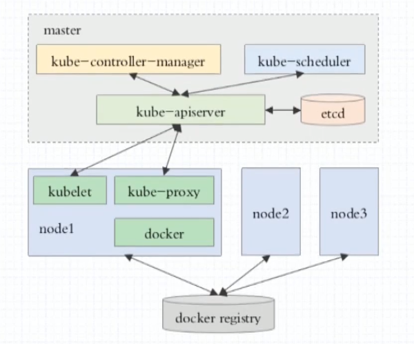
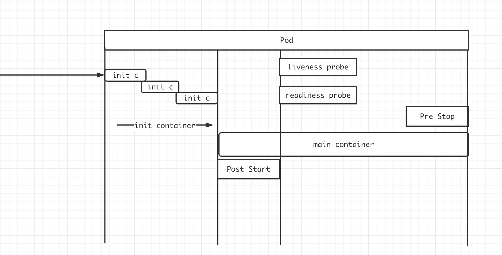
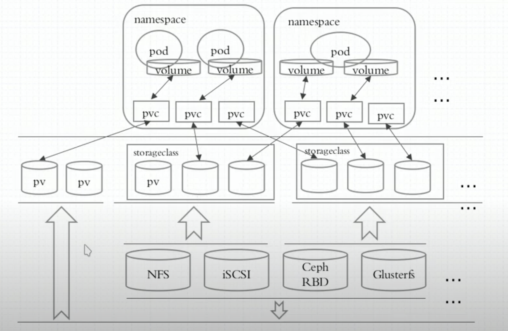
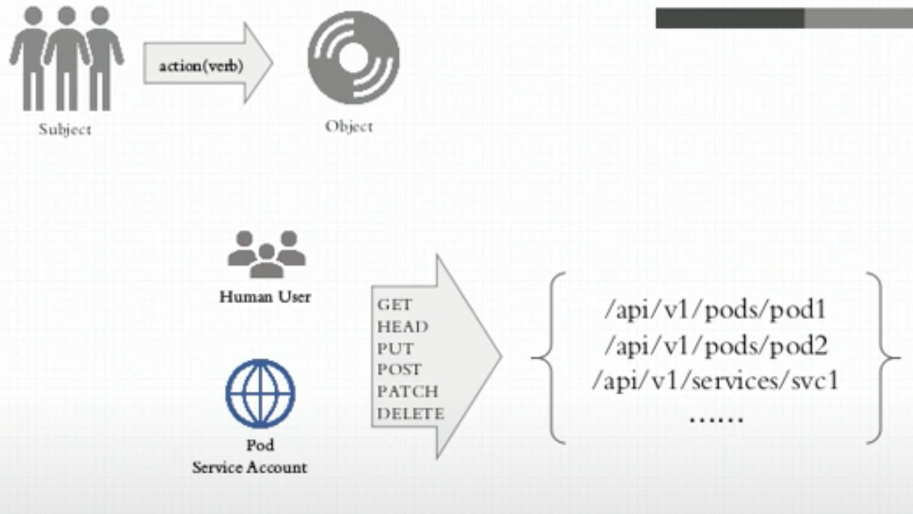

[](https://kubernetes.io/zh/docs/home/)

[](https://kubernetes.io/)

`Container Evolution`


## 容器编排

- `ansible/saltstack` **传统应用**编排工具
- `docker`
  - `docker compose` docker单机编排
  - `docker swarm` docker主机加入docker swarm资源池
  - `docker machine` 完成docker主机加入docker swarm资源池的先决条件/预处理工具
- `mesos(idc os) + marathon` 面向容器编排的框架
- `kubernetes(borg)`
  - 自动装箱(基于依赖 自动完成容器部署 不影响其可用性)
  - 自我修复
  - 水平扩展
  - 服务发现和负载均衡
  - 自动发布和回滚
  - 密钥和配置管理
  - 存储编排
  - 任务批量处理运行

## 概述

[概述](https://kubernetes.io/zh-cn/docs/concepts/overview/)

## 组件

[Kubernetes组件](https://kubernetes.io/zh-cn/docs/concepts/overview/components/)

## 集群安装

### 二进制安装

[参考kubeasz项目](https://github.com/easzlab/kubeasz)

### kubeadm安装

[使用kubeadm引导集群](https://kubernetes.io/zh-cn/docs/setup/production-environment/tools/kubeadm/)

- 图中docker组件可以替换为其他容器运行时组件([CRI](https://kubernetes.io/zh-cn/docs/concepts/architecture/cri/))
- 参考：[移除Dockershim的常见问题](https://kubernetes.io/zh-cn/blog/2022/02/17/dockershim-faq/)



- [CNI](https://kubernetes.io/zh-cn/docs/concepts/extend-kubernetes/compute-storage-net/network-plugins/)以[flannel](https://github.com/flannel-io/flannel)为例


#### 主机环境预设

- OS: Ubuntu 22.04 LTS
- Kubernetes: v1.29.13
- Container Runtime(二选一即可)
  - containerd
    - 官方仓库containerd
    - 或Docker社区提供的containerd.io
  - DockerCE-27.5.0 和 [cri-dockerd-0.3.16](https://github.com/Mirantis/cri-dockerd)

#### 测试环境说明

- 1master/2+node 也可以多master 根据自己环境安排
- 集群节点需要做时间同步
- 禁用swap
  - swapoff -a
  - systemctl --type swap
  - systemctl mask SWAP_DEV
- 禁用默认配置的iptables
- 加载br_netfilter模块
  - modprobe br_netfilter
  - 写入/etc/modules(开机启动)

#### 安装容器运行时

##### docker+cri-docekrd

- 安装docker-ce

```bash
apt -y install apt-transport-https ca-certificates curl software-properties-common
curl -fsSL http://mirrors.aliyun.com/docker-ce/linux/ubuntu/gpg | apt-key add -
add-apt-repository "deb [arch=amd64] http://mirrors.aliyun.com/docker-ce/linux/ubuntu $(lsb_release -cs) stable"
apt update

# 安装docker-ce
apt -y install docker-ce

# 进行完下面配置后 重启服务
systemctl restart docker
ststemctl enable docker
```

- docker配置
  - kubelet需要让docker容器引擎使用systemd作为CGroup的驱动 其默认值为cgroupfs
  - 我们还需要编辑docker的配置文件/etc/docker/daemon.json 参考下面配置
  - 其中的registry-mirrors用于指明使用的镜像加速服务 参考[国内无法下载Docker镜像的多种解决方案](https://isedu.top/index.php/archives/225/)
  - 提示: 自Kubernetes v1.22版本开始 未明确设置kubelet的cgroup driver时 则默认即会将其设置为systemd

```json
{
"registry-mirrors": [
  "https://dockerpull.cn"
],
"exec-opts": ["native.cgroupdriver=systemd"],
"log-driver": "json-file",
"log-opts": {
  "max-size": "200m"
},
"storage-driver": "overlay2"  
}
```

- 为docker设置代理(可选)
  - Kubeadm部署Kubernetes集群的过程中 默认使用Google的Registry服务registry.k8s.io上的镜像
  - 例如`registry.k8s.io/kube-apiserver`等 但国内部分用户可能无法访问到该服务
  - 我们也可以使用国内的镜像服务来解决这个问题 例如`registry.aliyuncs.com/google_containers`
  - 若选择使用国内的镜像服务 则配置代理服务的步骤为可选
  - 设置代理配置 编辑/lib/systemd/system/docker.service

```bash
# 重要提示: 
  # 节点网络(例如本示例中使用的192.168.0.0/16)
  # Pod网络(例如本示例中使用的10.244.0.0/16)
  # Service网络(例如本示例中使用的10.96.0.0/12)以及127网络等本地使用的网络
  # 必须明确定义为不使用所配置的代理 否则将很有可能带来无法预知的本地网络通信故障

# 请将下面配置段中的 $PROXY_SERVER_IP 替换为你的代理服务器地址
# 将$PROXY_PORT 替换为你的代理服所监听的端口
# 另外还要注意所使用的协议http是否同代理服务器提供服务的协议相匹配 如有必要 请自行修改为https
Environment="HTTP_PROXY=http://$PROXY_SERVER_IP:$PROXY_PORT"
Environment="HTTPS_PROXY=http://$PROXY_SERVER_IP:$PROXY_PORT"
Environment="NO_PROXY=127.0.0.0/8,172.17.0.0/16,172.29.0.0/16,10.244.0.0/16,192.168.0.0/16,10.96.0.0/12,magedu.com,cluster.local"

# 修改完配置重启服务
systemctl daemon-reload
systemctl restart docker
```

- 安装cri-dockerd
  - 直接去对应的[Github](https://github.com/Mirantis/cri-dockerd)项目下载对应的deb包安装

##### containerd

- 安装容器运行时containerd
  - Ubuntu 2204上安装Containerd有两种选择
    - Ubuntu系统官方程序包仓库中的containerd
    - Docker社区提供的`containerd.io`(本文选择该种方式)
  - 安装并启动containerd.io

```bash
# 生成containerd.io相关程序包的仓库 这里以阿里云的镜像服务器为例
apt -y install apt-transport-https ca-certificates curl software-properties-common
curl -fsSL http://mirrors.aliyun.com/docker-ce/linux/ubuntu/gpg | apt-key add -
add-apt-repository "deb [arch=amd64] http://mirrors.aliyun.com/docker-ce/linux/ubuntu $(lsb_release -cs) stable"
apt update
apt-get -y install containerd.io
```

- 配置`containerd.io`
  - 运行如下命令打印并保存如下配置

```bash
mkdir /etc/containerd
containerd config default > /etc/containerd/config.toml
```

- 编辑生成的配置文件 完成如下几项相关的配置

```bash
# 1. 修改containerd使用SystemdCgroup
[plugins."io.containerd.grpc.v1.cri".containerd.runtimes.runc]
[plugins."io.containerd.grpc.v1.cri".containerd.runtimes.runc.options]
  SystemdCgroup = true

# 2. 配置Containerd使用国内Mirror站点上的pause镜像及指定的版本
[plugins."io.containerd.grpc.v1.cri"]
sandbox_image = "registry.aliyuncs.com/google_containers/pause:3.9"

# 3. 配置Containerd使用国内的Image加速服务 以加速Image获取
[plugins."io.containerd.grpc.v1.cri".registry]
[plugins."io.containerd.grpc.v1.cri".registry.mirrors]
  [plugins."io.containerd.grpc.v1.cri".registry.mirrors."docker.io"]
    endpoint = ["https://docker.mirrors.ustc.edu.cn", "https://registry.docker-cn.com"]

[plugins."io.containerd.grpc.v1.cri".registry.mirrors."registry.k8s.io"]
endpoint = ["https://registry.aliyuncs.com/google_containers"]

# 4. 配置Containerd使用私有镜像仓库 不存在要使用的私有ImageRegistry时 本步骤可省略
[plugins."io.containerd.grpc.v1.cri".registry]
[plugins."io.containerd.grpc.v1.cri".registry.mirrors]
  [plugins."io.containerd.grpc.v1.cri".registry.mirrors."registry.minho.com"]
    endpoint = ["https://registry.minho.com"]

# 5. 配置私有镜像仓库跳过tls验证 若私有ImageRegistry能正常进行tls认证 则本步骤可省略
[plugins."io.containerd.grpc.v1.cri".registry.configs]
  [plugins."io.containerd.grpc.v1.cri".registry.configs."registry.minho.com".tls]
    insecure_skip_verify = true

# 6. 重启服务
systemctl restart containerd
```

- 配置crictl客户端
  - 安装containerd.io时 会自动安装命令行客户端工具crictl
  - 该客户端通常需要通过正确的unix sock文件才能接入到containerd服务
  - 编辑配置文件/etc/crictl.yaml 添加如下内容即可
  - 随后即可正常使用crictl程序管理Image/Container和Pod等对象
  - 另外containerd.io还有另一个名为ctr的客户端程序可以使用 其功能也更为丰富

```bash
runtime-endpoint: unix:///run/containerd/containerd.sock
image-endpoint: unix:///run/containerd/containerd.sock
timeout: 10
debug: true
```

#### 安装kubelet/kubeadm/kubectl

- 自v1.28版本开始 Kubernetes官方变更了仓库的存储路径及使用方式(不同的版本将会使用不同的仓库) 并提供了向后兼容至v1.24版本
- 因此 对于v1.24及之后的版本来说 可以使用如下有别于传统配置的方式来安装相关的程序包
- 以本示例中要安装的v1.29版本为例来说 配置要使用的程序包仓库 需要使用的命令如下
- 如若需要安装其它版本 则将下面命令中的版本号`v1.29`予以替换即可

```bash
apt-get update && apt-get install -y apt-transport-https
curl -fsSL https://mirrors.aliyun.com/kubernetes-new/core/stable/v1.29/deb/Release.key |    gpg --dearmor -o /etc/apt/keyrings/kubernetes-apt-keyring.gpg
echo "deb [signed-by=/etc/apt/keyrings/kubernetes-apt-keyring.gpg] https://mirrors.aliyun.com/kubernetes-new/core/stable/v1.29/deb/ /" |    tee /etc/apt/sources.list.d/kubernetes.list
apt-get update
apt-get install -y kubelet kubeadm kubectl
```

- 安装完成后 要确保kubeadm等程序文件的版本
- 这将也是后面初始化Kubernetes集群时需要明确指定的版本号

#### 整合kubelet和cri-dockerd

- 仅支持CRI规范的kubelet需要经由遵循该规范的cri-dockerd完成与docker-ce的整合
- 该步骤仅使用docker-ce和cri-dockerd运行时的场景中需要配置

##### 配置cri-dockerd

- 配置cri-dockerd 确保其能够正确加载到CNI插件
- 编辑`/usr/lib/systemd/system/cri-docker.service`文件 确保其[Service]配置段中的ExecStart的值类似如下内容

```bash
ExecStart=/usr/bin/cri-dockerd --container-runtime-endpoint fd:// --network-plugin=cni --cni-bin-dir=/opt/cni/bin --cni-cache-dir=/var/lib/cni/cache --cni-conf-dir=/etc/cni/net.d --pod-infra-container-image=registry.aliyuncs.com/google_containers/pause:3.9
```

- 需要添加的各配置参数(各参数的值要与系统部署的CNI插件的实际路径相对应)
  - `--network-plugin` 指定网络插件规范的类型 这里要使用CNI
  - `--cni-bin-dir` 指定CNI插件二进制程序文件的搜索目录
  - `--cni-cache-dir` CNI插件使用的缓存目录
  - `--cni-conf-dir` CNI插件加载配置文件的目录
  - `--pod-infra-container-image` Pod中的puase容器要使用的Image 默认为registry.k8s.io上的pause仓库中的镜像 不能直接获取到该Image时 要明确指定为从指定的位置加载 例如`registry.aliyuncs.com/google_containers/pause:3.9`
  - 配置完成后重启服务`systemctl restart cri-docker`

##### 配置kubelet

- 配置kubelet 为其指定cri-dockerd在本地打开的Unix Sock文件的路径
- 该路径一般默认为`/run/cri-dockerd.sock` 编辑文件/etc/sysconfig/kubelet 为其添加如下指定参数
  - 若/etc/sysconfig目录不存在 则需要先创建该目录
  - `KUBELET_KUBEADM_ARGS="--container-runtime=remote --container-runtime-endpoint=/run/cri-dockerd.sock"`

#### 初始化第一个主节点

- 该步骤开始尝试构建Kubernetes集群的master节点 配置完成后 各worker节点直接加入到集群中的即可
- 由于kubeadm部署的Kubernetes集群上 集群核心组件kube-apiserver、kube-controller-manager、kube-scheduler和etcd等均会以静态Pod的形式运行 它们所依赖的镜像文件默认来自于registry.k8s.io这一Registry服务之上
- 但我们无法直接访问该服务 常用的解决办法有如下两种
  - 使用能够到达该服务的代理服务
  - 使用国内的镜像服务器上的服务 例如`registry.aliyuncs.com/google_containers`等

##### 初始化master节点

- 在运行初始化命令之前先运行如下命令单独获取相关的镜像文件 而后再运行后面的`kubeadm init`命令 以便于观察到镜像文件的下载过程
- 若您选择使用的是docker-ce和cri-dockerd这一容器运行时环境 本文后续内容中使用的kubeadm命令 都需要额外添加`--cri-socket=unix:///var/run/cri-dockerd.sock`选项 以明确指定其所要关联的容器运行时
- 这是因为docker-ce和cri-dockerd都提供unix sock类型的socket地址 这会导致kubeadm在自动扫描和加载该类文件时无法自动判定要使用哪个文件 而使用containerd.io运行时 则不存在该类问题

```bash
# 下面的命令会列出类似如下的Image信息 由如下的命令结果可以看出 
# 相关的Image都来自于registry.k8s.io 该服务上的Image通常需要借助于代理服务才能访问到
root@k8s-master01:~# kubeadm config images list
registry.k8s.io/kube-apiserver:v1.29.13
registry.k8s.io/kube-controller-manager:v1.29.13
registry.k8s.io/kube-scheduler:v1.29.13
registry.k8s.io/kube-proxy:v1.29.13
registry.k8s.io/coredns/coredns:v1.11.1
registry.k8s.io/pause:3.9
registry.k8s.io/etcd:3.5.16-0

# 若需要从国内的Mirror站点下载Image 
# 还需要在命令上使用--image-repository选项来指定Mirror站点的相关URL
# 例如 下面的命令中使用了该选项将Image Registry指向国内可用的Aliyun的镜像服务 
# 其命令结果显示的各Image也附带了相关的URL
root@k8s-master01:~# kubeadm config images list --image-repository=registry.aliyuncs.com/google_containers
registry.aliyuncs.com/google_containers/kube-apiserver:v1.29.13
registry.aliyuncs.com/google_containers/kube-controller-manager:v1.29.13
registry.aliyuncs.com/google_containers/kube-scheduler:v1.29.13
registry.aliyuncs.com/google_containers/kube-proxy:v1.29.13
registry.aliyuncs.com/google_containers/coredns:v1.11.1
registry.aliyuncs.com/google_containers/pause:3.9
registry.aliyuncs.com/google_containers/etcd:3.5.16-0

# 运行下面的命令即可下载需要用到的各Image
# 需要注意的是 如果需要从国内的Mirror站点下载Image
# 同样需要在命令上使用--image-repository选项来指定Mirror站点的相关URL
kubeadm config images pull --image-repository=registry.aliyuncs.com/google_containers

---
[config/images] Pulled registry.aliyuncs.com/google_containers/kube-apiserver:v1.29.13
[config/images] Pulled registry.aliyuncs.com/google_containers/kube-controller-manager:v1.29.13
[config/images] Pulled registry.aliyuncs.com/google_containers/kube-scheduler:v1.29.13
[config/images] Pulled registry.aliyuncs.com/google_containers/kube-proxy:v1.29.13
[config/images] Pulled registry.aliyuncs.com/google_containers/coredns:v1.11.1
[config/images] Pulled registry.aliyuncs.com/google_containers/pause:3.9
[config/images] Pulled registry.aliyuncs.com/google_containers/etcd:3.5.16-0
```

- 而后即可进行master节点初始化
- kubeadm init命令支持两种初始化方式
  - 一是通过命令行选项传递关键的部署设定
  - 另一个是基于yaml格式的专用配置文件(建议)
  - 后一种允许用户自定义各个部署参数 在配置上更为灵活和便捷 下面分别给出了两种实现方式的配置步骤 建议读者采用第二种方式进行。

###### 方式1

- 运行如下命令完成k8s-master01节点的初始化
- 需要注意的是 若使用docker-ce和cri-dockerd运行时 则还要在如下命令上明确配置使用`--cri-socket=unix:///run/cri-dockerd.sock`选项

```bash
kubeadm init \
  --control-plane-endpoint="k8s-master01.minho.com" \
  --kubernetes-version=v1.29.13 \
  --pod-network-cidr=10.244.0.0/16 \
  --service-cidr=10.96.0.0/12 \
  --token-ttl=0 \
  --upload-certs \
  --cri-socket=unix:///run/cri-dockerd.sock
```

- 各选项含义
  - `--image-repository` 指定要使用的镜像仓库 默认为`registry.k8s.io`
  - `--kubernetes-version` kubernetes程序组件的版本号 它必须要与安装的kubelet程序包的版本号相同
  - `--control-plane-endpoint` 控制平面的固定访问端点 可以是IP地址或DNS名称 会被用于集群管理员及集群组件的kubeconfig配置文件的API Server的访问地址 单控制平面部署时可以不使用该选项
  - `--pod-network-cidr` Pod网络的地址范围 其值为CIDR格式的网络地址 通常Flannel网络插件的默认为10.244.0.0/16 Calico插件的默认值为192.168.0.0/16 而Cilium的默认值为10.0.0.0/8
  - `--service-cidr` Service的网络地址范围 其值为CIDR格式的网络地址 kubeadm使用的默认为10.96.0.0/12 通常 仅在使用Flannel一类的网络插件需要手动指定该地址
  - `--apiserver-advertise-address` apiserver通告给其他组件的IP地址 一般应该为Master节点的用于集群内部通信的IP地址 0.0.0.0表示节点上所有可用地址
  - `--token-ttl` 共享令牌(token)的过期时长 默认为24小时 0表示永不过期 为防止不安全存储等原因导致的令牌泄露危及集群安全 建议为其设定过期时长 未设定该选项时 在token过期后 若期望再向集群中加入其它节点 可以使用如下命令重新创建token 并生成节点加入命令
    - `kubeadm token create --print-join-command`
  - 提示：无法访问`registry.k8s.io`时 同样可以在上面的命令中使用`--image-repository=registry.aliyuncs.com/google_containers`选项 以便从国内的镜像服务中获取各Image
  - 注意：若各节点未禁用Swap设备 还需要附加选项`--ignore-preflight-errors=Swap` 从而让kubeadm忽略该错误设定

###### 方式二

- kubeadm也可通过配置文件加载配置 以定制更丰富的部署选项 获取内置的初始配置文件的命令
- `kubeadm config print init-defaults`
- 下面的配置示例 是以上面命令的输出结果为框架进行修改的 它明确定义了kubeProxy的模式为ipvs 并支持通过修改imageRepository的值修改获取系统镜像时使用的镜像仓库

```yaml
apiVersion: kubeadm.k8s.io/v1beta3
bootstrapTokens:
- groups:
- system:bootstrappers:kubeadm:default-node-token
token: minho.comc4mu9kzd5q7ur
ttl: 24h0m0s
usages:
- signing
- authentication
kind: InitConfiguration
localAPIEndpoint:
# 这里的地址即为初始化的控制平面第一个节点的IP地址
advertiseAddress: 172.29.7.1
bindPort: 6443
nodeRegistration:
# 注意 使用docker-ce和cri-dockerd时 要启用如下配置的cri socket文件的路径 
# criSocket: unix:///run/cri-dockerd.sock
imagePullPolicy: IfNotPresent
# 第一个控制平面节点的主机名称
name: k8s-master01.minho.com
taints:
- effect: NoSchedule
  key: node-role.kubernetes.io/master
- effect: NoSchedule
  key: node-role.kubernetes.io/control-plane
---
apiServer:
timeoutForControlPlane: 4m0s
# 将下面配置中的certSANS列表中的值 修改为客户端接入API Server时可能会使用的各类目标地址
certSANs:
- kubeapi.minho.com
- 172.29.7.1
- 172.29.7.2
- 172.29.7.3
- 172.29.7.253
apiVersion: kubeadm.k8s.io/v1beta3
# 控制平面的接入端点 我们这里选择适配到kubeapi.minho.com这一域名上
controlPlaneEndpoint: "kubeapi.minho.com:6443"
certificatesDir: /etc/kubernetes/pki
clusterName: kubernetes
controllerManager: {}
dns: {}
etcd:
local:
  dataDir: /var/lib/etcd
imageRepository: registry.aliyuncs.com/google_containers
kind: ClusterConfiguration
kubernetesVersion: v1.29.2
networking:
# 集群要使用的域名 默认为cluster.local
dnsDomain: cluster.local
# service网络的地址
serviceSubnet: 10.96.0.0/12
# pod网络的地址 flannel网络插件默认使用10.244.0.0/16
podSubnet: 10.244.0.0/16
scheduler: {}
---
apiVersion: kubeproxy.config.k8s.io/v1alpha1
kind: KubeProxyConfiguration
# 用于配置kube-proxy上为Service指定的代理模式 默认为iptables
mode: "ipvs"
```

- 将上面的内容保存于配置文件中 例如kubeadm-config.yaml
- 而后执行如下命令即能实现类似前一种初始化方式中的集群初始配置 但这里将Service的代理模式设定为ipvs
- `kubeadm init --config kubeadm-config.yaml --upload-certs`

#### 初始化完成后的操作步骤

- 对于Kubernetes系统的新用户来说 无论使用上述哪种方法 命令运行结束后 请记录最后的kubeadm join命令输出的最后提示的操作步骤
- 下面的内容是需要用户记录的一个命令输出示例 它提示了后续需要的操作步骤

```bash
Your Kubernetes control-plane has initialized successfully!

To start using your cluster, you need to run the following as a regular user:

  mkdir -p $HOME/.kube
  sudo cp -i /etc/kubernetes/admin.conf $HOME/.kube/config
  sudo chown $(id -u):$(id -g) $HOME/.kube/config

Alternatively, if you are the root user, you can run:

  export KUBECONFIG=/etc/kubernetes/admin.conf

You should now deploy a pod network to the cluster.
Run "kubectl apply -f [podnetwork].yaml" with one of the options listed at:
  https://kubernetes.io/docs/concepts/cluster-administration/addons/

You can now join any number of the control-plane node running the following command on each as root:

  kubeadm join k8s-master01.minho.com:6443 --token tkzmlw.406h8d9g8x9sf8z1 \
  --discovery-token-ca-cert-hash sha256:a32fe9b88096c3c0c22570a486302f58d3c479a8f1ccaf74b8fa4538a1a9d904 \
  --control-plane --certificate-key 502f1f1c87aea5a99dea3ee197878159f06a1f4178a8e7610ed228e6629a9414 \
  --cri-socket=unix:///run/cri-dockerd.sock

Please note that the certificate-key gives access to cluster sensitive data, keep it secret!
As a safeguard, uploaded-certs will be deleted in two hours; If necessary, you can use
"kubeadm init phase upload-certs --upload-certs" to reload certs afterward.

Then you can join any number of worker nodes by running the following on each as root:

kubeadm join k8s-master01.minho.com:6443 --token tkzmlw.406h8d9g8x9sf8z1 \
  --discovery-token-ca-cert-hash sha256:a32fe9b88096c3c0c22570a486302f58d3c479a8f1ccaf74b8fa4538a1a9d904 \
  --cri-socket=unix:///run/cri-dockerd.sock
```

- `kubeadm init`命令完整参考指南请移步[官方文档](https://kubernetes.io/docs/reference/setup-tools/kubeadm/kubeadm-init/)

##### 设定kubectl

- kubectl是kube-apiserver的命令行客户端程序 实现了除系统部署之外的几乎全部的管理操作 是kubernetes管理员使用最多的命令之一
- kubectl需经由API server认证及授权后方能执行相应的管理操作 kubeadm部署的集群为其生成了一个具有管理员权限的认证配置文件/etc/kubernetes/admin.conf
- 它可由kubectl通过默认的`$HOME/.kube/config`的路径进行加载 当然 用户也可在kubectl命令上使用--kubeconfig选项指定一个别的位置
- 下面复制认证为Kubernetes系统管理员的配置文件至目标用户(例如当前用户root)的家目录下
  - `mkdir ~/.kube` && `cp /etc/kubernetes/admin.conf  ~/.kube/config`

##### 部署网络插件

- Kubernetes系统上Pod网络的实现依赖于第三方插件进行 这类插件有近数十种之多 较为著名的有flannel、calico、canal和kube-router等 简单易用的实现为CoreOS提供的flannel项目
- 下面的命令用于在线部署flannel至Kubernetes系统之上 我们需要在初始化的第一个master节点k8s-master01上运行如下命令 以完成部署
- `kubectl apply -f https://github.com/flannel-io/flannel/releases/latest/download/kube-flannel.yml`
- 而后使用如下命令确认其输出结果中Pod的状态为`Running` 类似如下命令及其输入的结果所示
- `kubectl get pods -n kube-flannel`

##### 验证master节点已经就绪

```bash
kubectl get nodes

# 上述命令应该会得到类似如下输出 这表示k8s-master01节点已经就绪
NAME                     STATUS   ROLES           AGE     VERSION
k8s-master01.minho.com   Ready    control-plane   5d22h   v1.29.12

# 若准备有其它的master节点 以构建高可用的控制平面
# 可按照初始化控制平面第一个节点时输出的信息 在额外的master节点上运行添加命令 以完成控制平面其它节点的添加
# 相关的命令是形如下在的相关信息
kubeadm join k8s-master01.minho.com:6443 \
  --token tkzmlw.406h8d9g8x9sf8z1 \
  --discovery-token-ca-cert-hash sha256:a32fe9b88096c3c0c22570a486302f58d3c479a8f1ccaf74b8fa4538a1a9d904 \
  --control-plane --certificate-key 502f1f1c87aea5a99dea3ee197878159f06a1f4178a8e7610ed228e6629a9414 \
  --cri-socket=unix:///run/cri-dockerd.sock
```

##### 添加节点到集群中

- 下面的两个步骤 需要分别在k8s-node01、k8s-node02和k8s-node03上各自完成
  - 若未禁用Swap设备 编辑kubelet的配置文件/etc/default/kubelet 设置其忽略Swap启用的状态错误
    - 内容如下：KUBELET_EXTRA_ARGS="--fail-swap-on=false"
  - 将节点加入第二步中创建的master的集群中 要使用主节点初始化过程中记录的kubeadm join命令
    - 再次提示 若使用docker-ce和cri-dockerd运行时环境 则需要在如下命令中额外添加`--cri-socket=unix:///run/cri-dockerd.sock`选项

  ```bash
  kubeadm join k8s-master01.minho.com:6443 --token tkzmlw.406h8d9g8x9sf8z1 \
    --discovery-token-ca-cert-hash sha256:a32fe9b88096c3c0c22570a486302f58d3c479a8f1ccaf74b8fa4538a1a9d904 \
    --cri-socket=unix:///run/cri-dockerd.sock
  ```

##### 验证节点添加结果

- 在每个节点添加完成后 即可通过kubectl验证添加结果
- 下面的命令及其输出是在所有的三个节点均添加完成后运行的 其输出结果表明三个Worker Node已经准备就绪

```bash
root@k8s-master01:~# kubectl get nodes
NAME                     STATUS   ROLES           AGE     VERSION
k8s-master01.minho.com   Ready    control-plane   5d22h   v1.29.12
k8s-node01.minho.com     Ready    <none>          5d22h   v1.29.12
k8s-node02.minho.com     Ready    <none>          5d22h   v1.29.12
k8s-node03.minho.com     Ready    <none>          5d22h   v1.29.12
```

##### 测试应用编排及服务访问

- 到此为止 一个master/三个worker的kubernetes集群基础设施已经部署完成 用户随后即可测试其核心功能
- 例如 下面的命令可将demoapp以Pod的形式编排运行于集群之上 并通过在集群外部进行访问

```bash
kubectl create deployment demoapp --image=ikubernetes/demoapp:v1.0 --replicas=3
kubectl create service nodeport demoapp --tcp=80:80

# 而后 使用如下命令了解Service对象demoapp使用的NodePort 以便于在集群外部进行访问
root@k8s-master01:~# kubectl get svc -l app=demoapp
NAME     TYPE       CLUSTER-IP     EXTERNAL-IP   PORT(S)       AGE
demoapp   NodePort   10.100.84.12   <none>       80:30622/TCP   2s
```

- demoapp是一个web应用 因此 用户可以于集群外部通过`http://NodeIP:30622`这个URL访问demoapp上的应用
- 我们也可以在Kubernetes集群上启动一个临时的客户端 对demoapp服务发起访问测试
- `kubectl run client-$RANDOM --image=ikubernetes/admin-box:v1.2 --rm --restart=Never -it --command -- /bin/bash`
- 而后 在打开的交互式接口中 运行如下命令 对demoapp.default.svc服务发起访问请求 验证其负载均衡的效果
- `root@client-3021 ~# while true; do curl demoapp.default.svc; sleep 1; done`
- 清理部署的测试应用
  - `kubectl delete deployments/demoapp services/demoapp`

##### 部署Add-ons(可选步骤)

- MetalLB
- Ingress Nginx
- Metrics Server
- Kuboard

## 配置对多集群的访问

[配置对多集群的访问](https://kubernetes.io/zh-cn/docs/tasks/access-application-cluster/configure-access-multiple-clusters/)

```bash
# 添加集群信息
kubectl config --kubeconfig=config-demo set-cluster development --server=https://1.2.3.4 --certificate-authority=fake-ca-file

# 添加用户信息
kubectl config --kubeconfig=config-demo set-credentials developer --client-certificate=fake-cert-file --client-key=fake-key-seefile

# 添加上下文
kubectl config --kubeconfig=config-demo set-context dev-frontend --cluster=development --namespace=frontend --user=developer

# 查看配置文件详情
# 直接打开文件或使用如下命令
kubectl config --kubeconfig=config-demo view

# 设置当前上下文
kubectl config --kubeconfig=config-demo use-context dev-frontend

# 使用--minify参数 来查看与当前上下文相关联的配置信息
kubectl config --kubeconfig=config-demo view --minify

# 设置 KUBECONFIG 环境变量
export KUBECONFIG="${KUBECONFIG}:config-demo:config-demo-2"

```

## 资源清单定义

- 创建资源的方法

  - apiserver仅接收json格式的资源定义

  - yaml格式提供配置清单 apiserver可自动将其转换为json格式 而后再提交

- 大部分资源的配置清单 主要都有五个主要的部分组成

  - apiversion
    - `kubectl api-versions` # 所属API群组
    - 标识方式: `group/version` 省略组名则为core group

  - kind: 资源类别
  - metadata: 元数据
    - name: 同一类别中 name需要唯一
    - namespace: 所属k8s的哪个名称空间
    - labels
    - annotations
    - 每个资源的引用PATH
      - `/api/${GROUP/VERSION}/namespace/${NAMESPACE}/${TYPE}/${NAME}`
  - spec(重要): 定义用户期望的状态 disired state
  - status: 当前状态 current state 本字段由Kubernetes集群维护

- 字段太多 可以借助`kubectl explain --help`命令查看详细信息

  - kubectl explain pod
  - kubectl explain pod.metadata

### Pod概述

[pods](https://kubernetes.io/zh-cn/docs/concepts/workloads/pods/)

#### 自主式Pod

```yaml
apiVersion: v1
kind: Pod
metadata:
  name: pod-demo
  namespace: default
  labels:
    app: myapp
    tier: frontend
spec:
  containers:
    - name: myapp
      image: nginx:alpine
    - name: busybox
      image: busybox:latest
      command:
        - "/bin/sh"
        - "-c"
        - "sleep 3600"
```

#### Pod资源

- spec.containers <[]object>

  ```yaml
  # kubectl explain pod.spec.containers
  - name: <string>
    image: <string>
    imagePullPolicy: <string>  # Always Never IfNotPresent
    ...

  # 修改镜像中的默认应用
  - command/args
  https://kubernetes.io/docs/tasks/inject-data-application/define-command-argument-container/
  ```

- 标签
  - key = value
    - key: 字母 数字 _ - .
    - value: 可以为空 只能字母或数字开头及结尾

- 标签选择器
  - 等值关系: =、==、!=(不等于会筛选出不具有该标签的资源)
  - 集合关系
    - KEY in (VALUE1,VALUE2,...)
    - KEY notin (VALUE1,VALUE2,...)
    - KEY    # 存在这个KEY就行
    - !KEY   # 不存在此键的资源

- 许多资源支持内嵌字段来使用标签选择器
  - matchLabels: 直接给定键值
  - matchExpressions: 基于给定的表达式来定义使用标签选择器
    - {key: "KEY", operator: "OPERATOR",values:[VAL1,VAL2,VAL3,...]
    - 操作符
      - In、NotIn: values字段的值必须为非空列表
      - Exists、NotExists: values字段的值必须为空列表

- spec.nodeSelector <map[striong]string>
  - 节点标签选择器
- spec.nodeName `<string>`  # 直接指定运行node
- annotations
  - 与label不同的地方在于 它不能用于挑选资源对象 仅用于为对象提供**元数据**
  - 没有键长度/值长度限制
- spec.restartPolicy
  - 重启策略: One of Always, OnFailure, Never. Default to Always

#### Pod生命周期

- 状态

  - Pending  # 调度尚未完成
  - Running  # 运行状态
  - Failed
  - Succeeded
  - Unknown
  - ...

- Pod生命周期中的重要行为

  - 初始化容器
  - 容器探测(自定义命令/TCP套接字发请求/HTTP应用层请求)
    - liveness probe: 探测容器是否存活
    - readiness probe: 探测容器是否准备就绪 能对外提供服务
  - 钩子
    - post start
    - pre stop

  

#### Pod容器探针类型

`kubectl explain pod.spec.containers.livenessProbe`

`kubectl explain pod.spec.containers.readinessProbe`

- exec Action
- httpGet Action
- tcpSocket Action

#### Pod控制器

- ReplicaSet

  - Kubectl explain replicaset
  - 用户期望副本数 标签选择器 Pod资源模版
  - 不建议直接使用ReplicaSet

  ```yaml
  apiVersion: apps/v1
  kind: ReplicaSet
  metadata:
    name: myapp
    namespace: default
  spec:
    replicas: 2
    selector:
      matchLabels:
        app: myapp
        release: canary
    template:
      metadata:
        name: myapp-pod
        labels:
          app: myapp
          release: canary
          environment: qa
      spec:
        containers:
        - name: myapp-container
          image: nginx:alpine
          ports:
          - name: http
            containerPort: 80
  ```

- Deployment
  - 构建在ReplicaSet之上 而非Pod
    - 实现滚动更新(多出或少于N个副本 控制更新粒度)、回滚
    - 通常管理10个历史版本(ReplicaSet)
  - 管理无状态应用最好的控制器
  - 无状态(只关注群体、不关注个体)、持续运行应用
  - 声明式管理(即可以创建 也可以更新 `kubectl apply -f deployment.yaml`)
  - `kubectl rollout history` 查看滚动历史


- DaemonSet
  
  - `kubectl explain deployment.spec.strategy.rollingUpdate` # 滚动更新策略
  
  - 确保集群中的每一个节点(或部分满足条件的节点)精确运行一个Pod副本
  - 通常用于一些系统级的后台任务
  - 无状态、持续运行应用
  
- Job
  - 只做一次 只要完成就正常退出 没完成才进行重构
  - 执行一次性的作业
  - 不需要持续在后台运行 执行完成就退出
  
- Cronjob
  - 周期性Job
  
- StatefulSet
  - 管理有状态应用
  - 每一个pod副本单独管理 拥有自己独有的标识和独有的数据集
  
- TPR: Third Party Resources 1.2+ - 1.7

- CDE: Custom Defined Resources 1.8+

- Operator

### Service概述

#### Service代理

[services-networking](https://kubernetes.io/zh-cn/docs/concepts/services-networking/service/)

- userspace
  - kube-proxy会监视Kubernetes控制平面对Service对象和Endpoints对象的添加和移除操作
  - 对每个Service它会在本地Node上打开一个端口(随机选择)  任何连接到**代理端口**的请求 都会被代理到Service的后端`Pods`中的某个上面
    - 使用哪个后端Pod是 kube-proxy 基于`SessionAffinity`来确定的
  - 最后 它配置 iptables 规则 捕获到达该 Service 的`clusterIP`(是虚拟 IP)和`Port`的请求 并重定向到代理端口 代理端口再代理请求到后端Pod
    - 默认情况下 用户空间模式下的kube-proxy通过轮转算法选择后端
  - 流量来回在内核和用户空间切换 效率较低


- iptables
  - `kube-proxy`会监视Kubernetes控制节点对Service对象和Endpoints对象的添加和移除
  - 对每个Service 它会配置iptables规则 从而捕获到达该Service的`clusterIP`和端口的请求 进而将请求重定向到 Service 的一组后端中的某个Pod上面
  - 对于每个Endpoints对象 它也会配置iptables规则 这个规则会选择一个后端组合
    - 默认的策略是 kube-proxy在iptables模式下随机选择一个后端

  - 使用iptables处理流量具有较低的系统开销 因为流量由Linux netfilter处理 而无需在用户空间和内核空间之间切换 这种方法也可能更可靠
  - 如果kube-proxy在iptables模式下运行 并且所选的第一个 Pod 没有响应 则连接失败
    - 这与用户空间模式不同: 在这种情况下 kube-proxy将检测到与第一个Pod的连接已失败 并会自动使用其他后端Pod 重试
    - 可以使用Pod[就绪探测器](https://kubernetes.io/zh-cn/docs/concepts/workloads/pods/pod-lifecycle/#container-probes) 验证后端Pod可以正常工作 以便iptables模式下的kube-proxy仅看到测试正常的后端 避免将流量通过kube-proxy发送到已知已失败的 Pod


- ipvs
  - 特性状态： Kubernetes v1.11 [stable]
  - 在`ipvs`模式下 kube-proxy监视Kubernetes服务和端点 调用`netlink`接口创建相应的IPVS规则 并定期将IPVS规则与Kubernetes服务和端点同步 该控制循环可确保 IPVS 状态与所需状态匹配
  - 访问服务时 IPVS将流量定向到后端Pod之一
  - IPVS代理模式基于类似于iptables模式的netfilter挂钩函数 但是使用哈希表作为基础数据结构 并且在内核空间中工作
    - 这意味着 与iptables模式下的kube-proxy相比 IPVS模式下的kube-proxy重定向通信的延迟要短 并且在同步代理规则时具有更好的性能
    - 与其他代理模式相比 IPVS模式还支持更高的网络流量吞吐量

  - IPVS提供了更多选项来平衡后端Pod的流量
    - `rr`: 轮询(Round-Robin)
    - `lc`: 最少链接(Least Connection) 即打开链接数量最少者优先
    - `dh`: 目标地址哈希(Destination Hashing)
    - `sh`: 源地址哈希(Source Hashing)
    - `sed`: 最短预期延迟(Shortest Expected Delay)
    - `nq`: 从不排队(Never Queue)
  - 备注
    - 要在IPVS模式下运行kube-proxy必须在启动kube-proxy之前使IPVS在节点上可用
    - 当kube-proxy以IPVS代理模式启动时 它将验证IPVS内核模块是否可用
      - 如果未检测到IPVS内核模块 则kube-proxy将退回到以iptables代理模式运行


#### Service类型

- ClusterIP: 通过集群的内部IP暴露服务 选择该值时服务只能够在集群内部访问 这也是默认的`ServiceType`
- [NodePort](https://kubernetes.io/zh-cn/docs/concepts/services-networking/service/#type-nodeport): 通过每个节点上的IP和静态端口(NodePort)暴露服务  NodePort服务会路由到自动创建的ClusterIP服务
  - 通过请求 `<节点IP>:<节点端口>` 你可以从集群的外部访问一个NodePort服务
  - Client -> NodeIP:NodePort -> ClusterIP:ServicePort -> PodIP:containerPort
  - 为避免单Node压力过大 会在外面再加一层负载均衡
    - 公有云环境: LBaaS(参考下面LoadBalancer类型)
- [LoadBalancer](https://kubernetes.io/zh-cn/docs/concepts/services-networking/service/#loadbalancer): 使用云提供商的负载均衡器向外部暴露服务 外部负载均衡器可以将流量路由到自动创建的NodePort服务和ClusterIP服务上
- [ExternalName](https://kubernetes.io/zh-cn/docs/concepts/services-networking/service/#externalname): 通过返回CNAME和对应值 可以将服务映射到externalName字段的内容(例如`foo.bar.example.com`) 无需创建任何类型代理
  - FQDN(CoreDNS 内部解析)
    - CNAME -> FQDN(外部真正的FQDN )

#### Headless Services(无头Service)

- 有时不需要或不想要负载均衡 以及单独的Service IP 遇到这种情况 可以通过指定Cluster IP(`spec.clusterIP`)的值为 `"None"`来创建 `Headless` Service
- 你可以使用一个无头Service与其他服务发现机制进行接口 而不必与Kubernetes的实现捆绑在一起
- 对于无头`Services`并不会分配Cluster IP kube-proxy不会处理它们 而且平台也不会为它们进行负载均衡和路由 DNS如何实现自动配置 依赖于Service是否定义了选择算符

### Ingress


[ingress](https://kubernetes.io/zh-cn/docs/concepts/services-networking/ingress/)

- Service对后端特定类型Pod分类(label selector)
- Ingress基于上面的分类识别后端Pod 并生成配置信息注入到nginx(需要重载配置)/envoy/traefik等

[ingress-controllers](https://kubernetes.io/zh-cn/docs/concepts/services-networking/ingress-controllers/)

### 存储卷

[kubernetes-storage](https://kubernetes.io/zh-cn/docs/concepts/storage/)

`kubectl explain pods.spec.volumes`

- emptyDir # 临时目录 随pod删除而消失(生命周期同pod)
  - gitRepo(clone到机器 修改不会同步 需要同步可以自己再做一个sidecar)
- hostPath # 宿主机路径
- SAN(iSCSI...)、NAS(nfs、cifs...)
- 分布式存储
  - glusterfs、rdb、cephfs
- 云存储
  - EBS、Azure Disk...

#### PV/PVC



#### StorageClass

- 存储设备需支持RESTful风格的创建请求
- 根据请求动态创建PV

#### ConfigMap

- ConfigMap是一种 API 对象 用来将非机密性的数据保存到键值对中
- 使用时[Pods](https://kubernetes.io/docs/concepts/workloads/pods/pod-overview/)可以将其用作环境变量、命令行参数或者存储卷中的配置文件
- ConfigMap将你的环境配置信息和[容器镜像](https://kubernetes.io/zh-cn/docs/reference/glossary/?all=true#term-image)解耦 便于应用配置的修改

##### 容器化配置应用方式

- 自定义命令行参数
  - args: []
- 把配置文件直接打包至镜像
- 环境变量
  - CloudNative的应用程序一般可直接通过环境变量加载配置
  - 通过entrypoint脚本来预处理变量为配置文件中的配置信息
- 存储卷

#### Secret

- Secret是一种包含少量敏感信息例如密码、令牌或密钥的对象 这样的信息可能会被放在[Pod](https://kubernetes.io/docs/concepts/workloads/pods/pod-overview/)规约中或者镜像中
- 使用Secret意味着你不需要在应用程序代码中包含机密数据
- Secret类似于[ConfigMap](https://kubernetes.io/zh-cn/docs/tasks/configure-pod-container/configure-pod-configmap/)但专门用于保存敏感数据

## StatefulSet控制器

- CoreOS Operator
- cattle/pet # 一个关注群体 一个关注个体(和无状态应用的区别)
- PetSet(1.3) -> StatefulSet(1.5+)
- StatefulSet主要用于管理有以下特性的应用程序
  - 稳定且唯一的网络标识符
  - 稳定且持久的存储
  - 有序、平滑的部署和扩展
  - 有序、平滑的终止和删除
  - 有序的滚动更新
- 一般来说 一个典型的StatefulSet由三个组件组成
  - handless service              # 无头服务 确保名称唯一
  - StatefulSet                         # 控制器
  - volumeClaimTemplate # 存储卷申请模版(不能使用同一存储卷 pod模版创建的存储卷都是一样的 所以需要卷申请模版)

- `kubelet explain sts.spec.updateStrategy.rollingUpdate`
  - partition \<inter\> # 控制更新的Pod
  - partition: N         # 大于等于编号N的Pod将被更新 默认值: 0

## 认证及ServiceAccount

### 认证授权

- 认证(支持多种认证方式) # 认证插件
  - 令牌认证 bearer token
  - ssl认证(确认服务端/客户端身份) 双向证书认证(https)
  - ...
- 授权检查(权限) # 授权插件
  - RBAC # kubeadm部署的集群强制开启RBAC
  - ...
- 准入控制(关联的其他资源或操作 是否有权限 进一步补充授权机制)
- API Server需要信息去识别客户端的操作
  - user: username + uid
  - group
  - extra
  - API(请求的Kubernetes API)
    - Request Path
      - `kubectl proxy --port=8080`
      - `curl http://localhost:8080/api/v1/namespaces`
      - `curl http://localhost:8080/apis/apps/v1/namespaces/default/deployments/myapp-deploy/`
    - HTTP request verb
      - GET POST PUT DELETE
      - get list create update patch watch proxy redirect delete deletecollection
    - Resources
    - SubResources
    - Namespace
    - API Group

### ServiceAccount

- 访问APIServer的两种客户端
  - kubectl/dashborad 集群外部客户端(userAccount)
  - pod 集群内部客户端(serviceAccount)
    - `kubectl explain pods.spec.serviceAccountName`
- kubeconfig
  - `kubectl config view`

### RBAC授权

- 授权插件
  - Node
  - ABAC(*Attribute-based access control*)
  - RBAC(*Role-based access contro*)
  - Webhook



- K8S-RBAC
  - role
    - operations
    - objects
  - rolebinding
    - user account OR service account
    - role
  - `kubectl create role pods-reader --verb=get,list,watch --resource=pods --dry-run -o yaml`


## Helm

- 类似yum

## Reference

- ubuntu

[apt install speciffic version](https://askubuntu.com/questions/428772/how-to-install-specific-version-of-some-package/428778#428778?newreg=d056242a7a0340598dd1d2d4fad63e81)

[set-proxy-on-ubuntu-docker](https://www.serverlab.ca/tutorials/containers/docker/how-to-set-the-proxy-for-docker-on-ubuntu/)

[apt-get-like-yum-whatprovides](https://askubuntu.com/questions/2493/apt-get-or-aptitude-equivalent-to-yum-whatprovides)

- kubetnetes

[kubectl-get-commponentstatus-shows-unhealthy](https://stackoverflow.com/questions/63136175/kubectl-get-componentstatus-shows-unhealthy)
